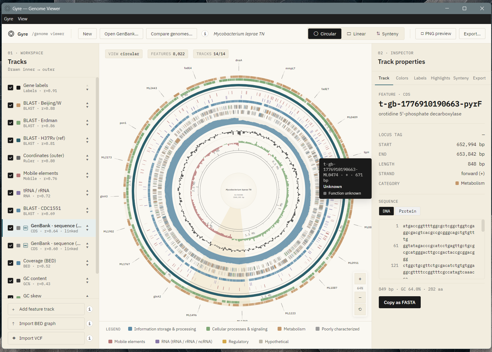
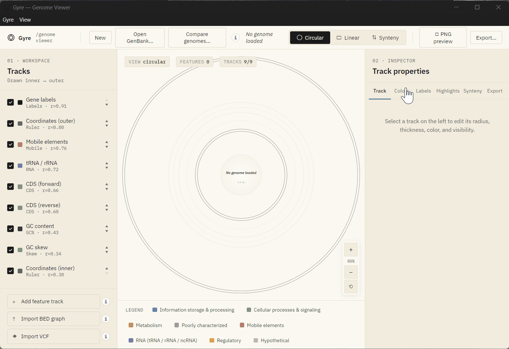
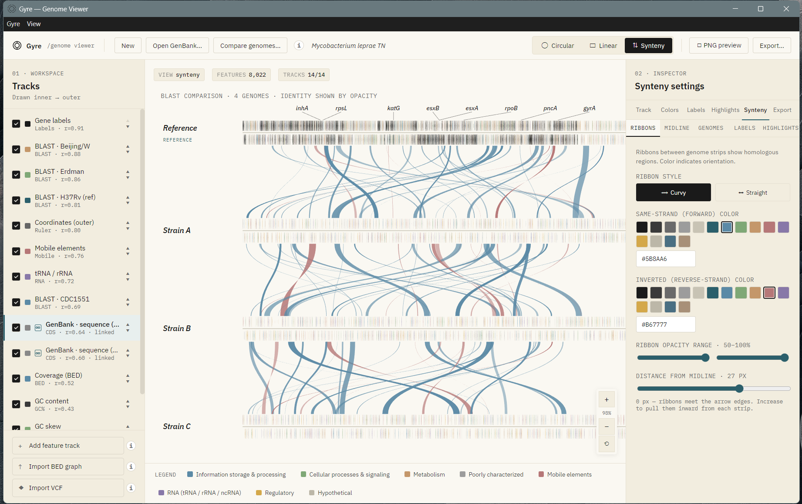

# Gyre Genome Viewer

> ⚠️ **Beta Release** - This is an early development version. Core functionality is stable, but the application continues to evolve. Expect changes and please report issues.

A desktop application for interactive visualization and comparative analysis of genomic sequences. Gyre supports multiple visualization modes (circular, linear, synteny) and integrates BLAST for sequence comparison. All computations run locally without requiring internet connectivity or external dependencies.

## Installation

### Windows

Download the latest installer from [Releases](https://github.com/Febo2788/genome-visualizer/releases):

```
Gyre Setup 1.0.0.exe
```

The installer includes BLAST+ binaries and requires approximately 500MB of disk space. Windows Defender may flag the executable on first run, which is normal for unsigned applications.

### macOS

Currently none as I don't have a mac

## Getting Started

### Basic Workflow

1. Launch Gyre from the Start Menu or desktop shortcut
2. Click "Open GenBank..." to load a genomic sequence file
3. Select a visualization mode: Circular, Linear, or Synteny
4. (Optional) Click "Compare genomes..." to run BLAST analysis

### Loading Genomic Data

Gyre accepts GenBank files (.gb, .gbk) as the primary input format. GenBank files can be downloaded from:

- NCBI Nucleotide Database: https://www.ncbi.nlm.nih.gov/nucleotide/
- Search for organism, select sequence, export as "GenBank" format

### Visualization Modes

**Circular View**: Displays complete genome sequence with concentric rings representing genomic features, annotations, and comparative tracks. Optimal for single-genome overview and publication-quality diagrams.

**Linear View**: Scrollable and zoomable linear representation of genomic sequences. Useful for examining specific genomic regions, examining feature density, and detailed annotation inspection.

**Synteny View**: Side-by-side comparison of two genomic sequences with collinear regions highlighted. Requires prior BLAST comparison analysis.

### BLAST Comparative Genomics

1. Click "Compare genomes..." in the toolbar
2. Select reference genome (target sequence for comparison)
3. Select one or more query genomes (sequences to align)
4. Configure BLAST parameters (identity threshold, alignment length)
5. Click "Run BLAST" to initiate comparison
6. Results display upon completion as colored regions in synteny view

Note: Processing time is proportional to genome size. Whole-genome comparisons typically require 10-30 minutes for sequences exceeding 5MB.

## Features

- **Multiple Visualization Modes**: Circular, linear, and synteny views accommodate different analytical requirements
- **Local BLAST Integration**: Comparative genomics analysis without external services
- **Genomic Feature Annotation**: Display genes, repeats, regulatory elements, and other annotations
- **Multi-Track Support**: Simultaneous visualization of coverage data, variants, and custom tracks
- **Publication Export**: Export diagrams in PNG, SVG, and PDF formats
- **Offline Operation**: Complete analysis capability without internet connectivity
- **Cross-Platform Support**: Electron-based application for Windows and macOS

## Supported File Formats

| Format | Extensions | Description |
|--------|-----------|-------------|
| GenBank | .gb, .gbk | Standard genomic sequence format with annotations (NCBI) |
| BED | .bed | Genomic intervals (0-based coordinates, tab-delimited) |
| bedGraph | .bedgraph | Genomic intervals with associated numeric values |
| VCF | .vcf | Variant call format for genomic variations |

## Visualization Examples

### Circular Genome View



Circular visualization displays the complete genomic sequence with concentric rings representing different annotation types and comparative tracks. Multiple features including genes, repeats, and variants are color-coded for easy identification.

### BLAST Comparison Results



Animated demonstration of BLAST comparative genomics workflow showing genome selection, comparison execution, and resulting synteny visualization with collinear regions highlighted.

### Circular View Animation


Interactive circular view showing multiple annotation tracks and comparison rings. Demonstrates how comparative genomics data displays as concentric rings around the central genome sequence.

### Synteny Comparison View



Synteny view showing pairwise genome comparison with collinear regions displayed as connecting ribbons between two genomic sequences. Forward matches displayed in blue, inverted matches in red.

## Troubleshooting

### Application fails to start

Windows Defender and other antivirus software may block unsigned executables. Options:

1. Add executable to antivirus whitelist
2. Uninstall and reinstall application
3. Disable SmartScreen on first run (not recommended for general use)

### BLAST comparison produces no results

Verify the following:

1. Input genomes are in valid GenBank format
2. Genomes contain sufficient sequence similarity (test with known similar genomes)
3. BLAST parameters (identity threshold, alignment length) are appropriate for expected divergence
4. Check terminal window for error messages

### BLAST analysis runs slowly

This is expected behavior. Processing time depends on:

- Genome size (larger genomes require longer analysis)
- Number of genomes being compared
- System CPU and available memory
- BLAST parameter stringency

For testing, use small genome regions or smaller genomic sequences.

### "BLAST not found" error

Ensure BLAST+ binaries are properly installed. The application installer includes BLAST+ binaries, but manual installation is available:

**Windows**: `winget install ncbi-blast`
**macOS**: `brew install blast`

### Export functionality not working

Verify write permissions to the selected export directory. By default, exports are saved to the user's Downloads folder. If that location is restricted, select an alternative directory with write permissions.

## For Developers

### Building from Source

Prerequisites: Node.js 16+

```bash
npm install
npm run fetch-vendor      # Download React, Babel, fonts
npm run fetch-blast       # Download BLAST+ binaries
npm run build             # Build HTML from JSX
npm run electron          # Run in development mode
npm run dist:win          # Build Windows installer
```

### Project Architecture

Gyre is built with React for the frontend UI, Express.js for the backend API, and integrates NCBI BLAST+ for genomic sequence comparison. All computation runs locally on the user's machine without requiring internet connectivity.

## Citation

If Gyre is used in published research, please cite:

```
Gyre Genome Viewer (2025). Available at: https://github.com/Febo2788/genome-visualizer
```

## License

GNU General Public License v3.0. See LICENSE file for details.

## Issues and Support

Report bugs or request features at: https://github.com/Febo2788/genome-visualizer/issues
