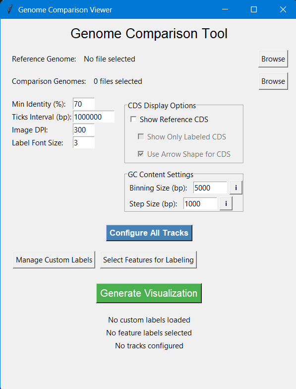
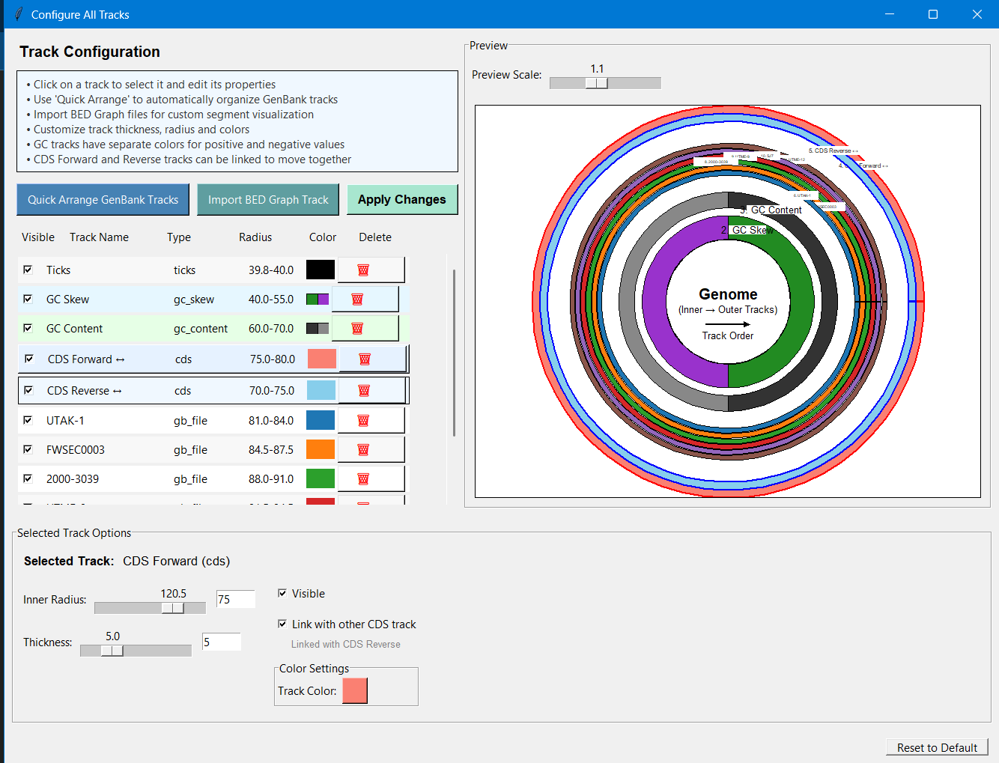
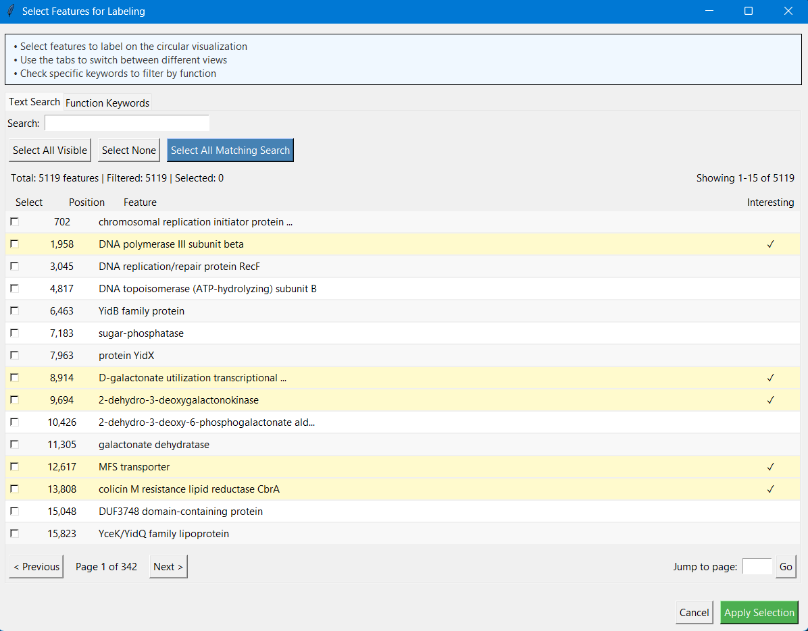
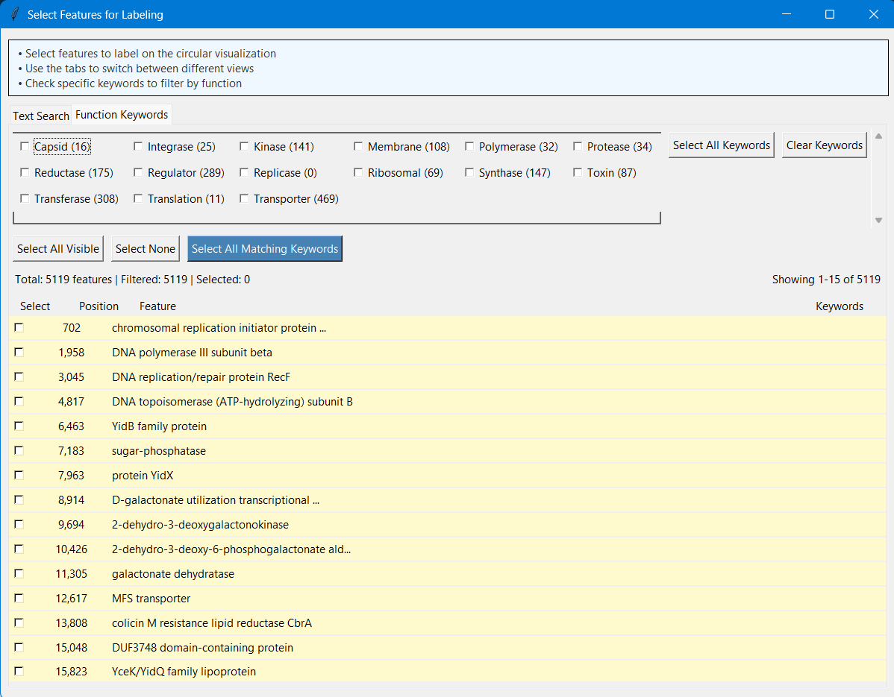

# Genomic Visualization Tool

A comprehensive Python-based tool for creating both linear and circular genomic visualizations from GenBank files. This tool provides a user-friendly GUI for generating publication-quality comparative genomic diagrams, significantly improving upon existing tools like BRIG by eliminating the need for data cleaning, offering more color options, and providing a live visualization interface.

## Features

### General Features
- Choose between linear and circular diagram visualization modes
- Interactive GUI for easy file selection and configuration
- Process multiple GenBank files for comparative analysis
- Customizable track visualization with color selection
- Export diagrams as high-quality PNG and PDF files

### Circular Diagram Features
- Create circular genome visualizations with multiple tracks
- Show GC content and GC skew with customizable binning
- Support for displaying CDS features with directional arrows
- Import and display BED graph tracks
- Add custom labels and annotations
- Enhanced track configuration with flexible radius settings
- Create separate legend files

### Linear Diagram Features (In Development)
- Create linear genomic track diagrams from multiple GenBank files
- Reorder and customize display of genomic tracks
- Identify and color gene groups across different genomes
- Generate cross-links between genomes using BLAST comparison
- Support for custom annotations and highlighting of genomic regions
- Interactive track labeling system
- Customizable gene coloring system with filtering

## Advantages Over Existing Tools

This tool was developed to address several limitations in existing genomic visualization software like BRIG:

- **No Data Cleaning Required**: Import GenBank files directly without preprocessing
- **Expanded Color Options**: Unlimited color selections for tracks and features
- **Live Visualization Interface**: See changes in real-time as you adjust settings
- **Integrated Feature Selection**: Search and filter genomic features directly within the tool
- **Dual Visualization Modes**: Both circular and linear (in development) visualization options

## Requirements

### Software Requirements
- Python 3.6 or higher
- NCBI BLAST+ command-line tools
- Tkinter (usually included with Python installations)

### Python Package Dependencies
- **Core dependencies**: Biopython, NumPy, Pandas, Matplotlib
- **Image processing**: OpenCV (cv2), PIL/Pillow, PyMuPDF (fitz)
- **Circular diagram specific**: pycirclize, pygenomeviz

## Installation

1. Ensure you have Python 3.6+ installed
2. Install BLAST+ tools from NCBI: https://blast.ncbi.nlm.nih.gov/Blast.cgi?CMD=Web&PAGE_TYPE=BlastDocs&DOC_TYPE=Download
3. Clone or download this repository
4. Install Python dependencies:

```bash
# For the basic dependencies
pip install biopython numpy pandas matplotlib opencv-python pillow PyMuPDF

# For circular diagrams
pip install pycirclize pygenomeviz
```

Note: The circular diagram module includes a function to automatically install its required packages if needed.

## Usage

1. Run the script:
```bash
python a_little_experiment.py
```

2. Select your preferred diagram type (Linear or Circular) from the opening dialog.

### Circular Diagram Workflow
1. Select a reference genome in GenBank format
2. Select comparison genomes in GenBank format
3. Configure visualization parameters (Min Identity, Ticks Interval, etc.)
4. Customize track display using the "Configure All Tracks" option
5. Add custom labels or select features for labeling if desired
6. Generate and save the visualization

### Linear Diagram Workflow (In Development)
1. Select GenBank files for analysis
2. Reorder the files and set display ranges if needed
3. Choose annotation categories to label
4. Customize gene colors and highlighting regions
5. The tool will perform BLAST analysis to identify cross-links between genomes
6. The final diagram will be generated as a PDF and automatically converted to PNG
7. Use the interactive labeling feature to add labels to the diagram

## Interface Screenshots

### Main Interface


*Main interface of the Circular Genome Visualization tool showing input options, track configuration settings, and visualization controls*

### Track Configuration


*Track configuration interface with interactive sliders and controls for customizing track appearance, position, and visibility*

### Feature Selection and Labeling


*Feature selection interface with text-based searching to identify and label genomic features*



*Function Keywords tab showing the ability to filter features by biological function categories*

### Search Features


*Example of feature search results showing gene information that can be selected for visualization*

## Output Visualizations

The tool generates publication-quality visualizations:
- Circular diagrams showing genome comparisons, GC content, GC skew, and annotations
- Linear comparison diagrams (in development) showing gene conservation with cross-links
- Separate legend files for reference

## Troubleshooting

- **BLAST Errors**: Ensure BLAST+ tools are properly installed and in your system PATH
- **Memory Issues**: When processing very large genomes, increase available memory or reduce the complexity of the visualization
- **File Format Issues**: Ensure your GenBank files are properly formatted
- **Track Visualization**: If tracks appear incorrectly, use the track configuration options to adjust display parameters

## Notes
- Linear view is still in development
- For large genomes, the BLAST comparison process may take significant time
- Customize binning size and step size based on your genome size for optimal GC content visualization
- Use the "Configure All Tracks" option for detailed control over track appearance

---

*This tool combines both linear and circular genomic visualization approaches in a single user-friendly package, allowing researchers to create publication-quality genomic visualizations with ease.*
